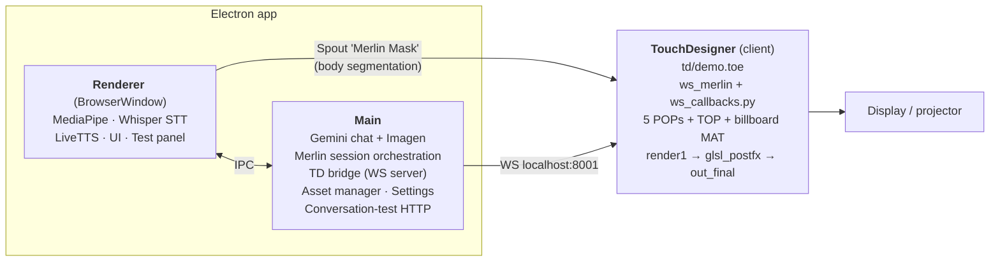
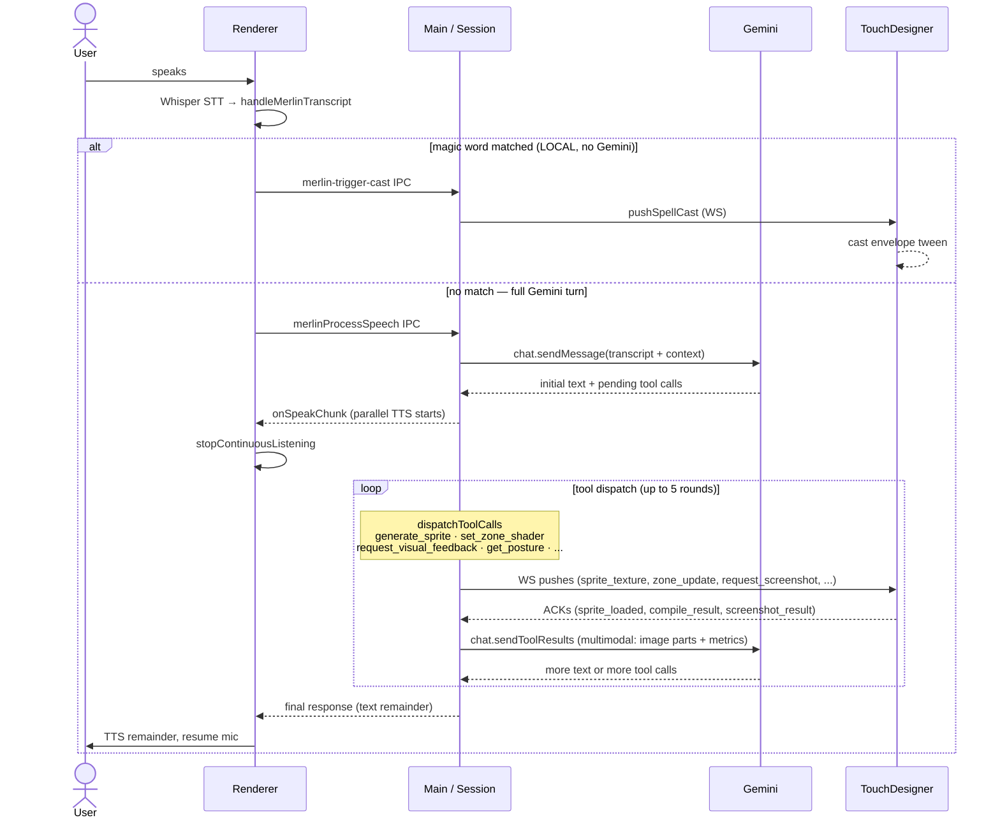
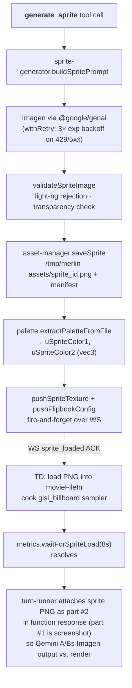

# System architecture

A bird's-eye view of where things live and how they talk. For per-turn detail, see [`conversation-flow.md`](./conversation-flow.md). For TD internals, see [`../td/ARCHITECTURE.md`](../td/ARCHITECTURE.md).

## Process layout

External services: **Gemini API** (chat, function calls, Imagen, TTS), **Anthropic API** (optional, Conversation Tester only).

## A user spell turn — full data flow

The most useful trace to internalize. This is what happens between "user speaks" and "particles change". Two paths fork at the magic-word check; the Gemini path is the common one.

## Asset pipeline (sprite generation)

## Error paths

| Failure | Detection | Recovery |
|---------|-----------|----------|
| Gemini 429 / 5xx / network | `withRetry` in `gemini-chat.ts` / `sprite-generator.ts` | Exponential backoff, 3 attempts. Final throw bubbles to session → user-visible error |
| GLSL compile failure | `_check_glsl_compile` in TD sends `compile_result {success: false}` | `pushZoneUpdateWithValidation` rolls back to previous good code or template default. `lastCompileSuccess=false` blocks subsequent `request_visual_feedback`. |
| Screenshot timeout | `requestScreenshot(send, 5000)` resolves null | Caller treats as "no data" — request_visual_feedback handler returns metrics-only response |
| Sprite-load timeout | `waitForSpriteLoad(id, 8000)` resolves `{success: false, timedOut: true}` | `generate_sprite` returns error → Gemini sees it and can retry with a different prompt |
| TD disconnect mid-turn | WS `close` event | `clearMetrics()` resolves all pending waits with disconnect failure. Tool handlers see the failures and continue or surface them. |
| Imagen safety block | Throws / returns no image | `_generateSpriteInternal` catches, returns `{success: false, error}` to caller |

## State ownership

- **Session phase, spell state, conversation history** → `MerlinSession` (`src/main/merlin/session.ts`) — single source of truth.
- **Per-zone compile state** → `ZoneStateManager` (`src/main/merlin/zone-state.ts`) — singleton.
- **Last-pushed sprite + flipbook config** → `td-state-mirror.ts` — read by `request_visual_feedback` to attach context.
- **TD metrics / visibility / latest screenshot** → `td-bridge/metrics.ts` — singleton, cleared on disconnect.
- **Persistent session history** → `state-persistence.ts` (disk, electron-store). Read by the Sessions tab.

## IPC, WS, and HTTP surfaces (where strings cross processes)

- **IPC**: `src/main/index.ts` registers every `ipcMain.handle('foo', ...)`. The renderer-side facade is `src/preload.ts`. The full event glossary lives in [`conversation-flow.md`](./conversation-flow.md#ipc--ws-event-glossary).
- **WS**: `src/main/td-bridge/protocol.ts` (inbound) + `src/main/td-bridge/push.ts` (outbound). Message types listed in `CLAUDE.md`.
- **HTTP**: `src/main/conversation-test-trigger.ts` listens on `localhost:8765` (configurable via `MERLIN_TEST_TRIGGER_PORT`). One endpoint: `POST /run-conversation`. External callers (curl, Claude) kick off Conversation Tester presets without the UI.

## Configuration map

| Lives in | What it controls |
|----------|------------------|
| `.env` | API keys (`GEMINI_API_KEY`, `ANTHROPIC_API_KEY`), `MERLIN_LOG_LEVEL`, `MERLIN_TEST_TRIGGER_PORT` |
| `src/main/config.ts` | Ports (8001 TD bridge, 8765 trigger), timeouts (screenshot 5s, sprite-load 8s, compile 5s), retry counts (3, 1s base, 10s cap) |
| `src/main/merlin/zone-registry.ts` | Per-zone validation contracts (modifies, vars, uniforms, banned keywords, max lines) |
| `src/main/merlin/system-prompts.ts` | Static prompt text (persona, tone rules, GLSL guidance, the two cached system prompts) |
| `src/main/merlin/session-context.ts` | Per-turn runtime context, phase framing, `ALLOWED_TOOLS_PER_PHASE` |
| `src/main/merlin/tool-definitions.ts` | Gemini tool `FunctionDeclaration` schemas + tool arrays (`MERLIN_TOOLS`, `MERLIN_VISUAL_AUTHOR_TOOLS`) |
| `td/scripts/ws_callbacks.py` | TD-side zone/uniform/sampler wiring and message dispatch |

## Where the magic actually happens

If you only have time to read four files, read these in this order:

1. `src/main/merlin/session.ts` — phase machine + lifecycle
2. `src/main/merlin/turn-runner.ts` — tool dispatch + screenshot eval
3. `src/main/merlin/system-prompts.ts` (long, the persona/tone/GLSL contract) + `src/main/merlin/tool-definitions.ts` (the tool contract surface). `session-context.ts` is the per-turn glue if you need it.
4. `td/scripts/ws_callbacks.py` — TD-side everything

Then `docs/conversation-flow.md` ties them together turn-by-turn.
