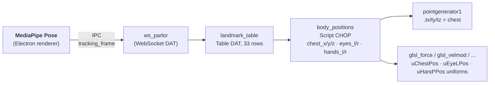
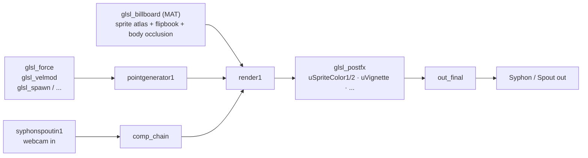

# TouchDesigner side — Architecture

The TD project (`td/demo.toe`) is the visual half of Merlin Mirror. It receives spell instructions over WebSocket from Electron and produces the final render: webcam composite, particles, sprites, post-FX. This document maps the .toe so you don't have to spelunk for it.

## COMP hierarchy

Everything lives under `/project1/`. The Electron-facing surfaces:

| Node | Role |
|------|------|
| `ws_parlor` (WebSocket DAT) | Connects to `ws://localhost:8001`. `td_ready` handshake on connect. |
| `ws_parlor_callbacks` (Text DAT) | Bound to `td/scripts/ws_callbacks.py` with `syncfile=1` — edits to the .py reflect immediately, no .toe save needed. |
| `landmark_table` (Table DAT) | MediaPipe pose landmarks pushed in by Electron each frame (33 rows × x/y/z/visibility). |
| `body_positions` (Script CHOP) | Reads `landmark_table` and emits world-space chest / eyes / hands as channels. Callbacks at `body_positions_callbacks1`. |
| `pointgenerator1` (POP) | Particle emitter. `tx/ty/tz` parameters are expression-bound to `body_positions.chest_x/y/z` so emission tracks the body. |
| `render1` (Render TOP) | Camera + geometry → render output. Width/height feed `uScreenResolution`. |
| `out_final` (Out TOP) | Final composite that goes to display / Syphon / Spout. |
| `syphonspoutin1` (Spout In TOP) | Raw webcam frame coming in from Electron's renderer. |
| `spout_mask` (Spout In TOP) | Body-segmentation mask coming in from Electron's `Merlin Mask` Spout sender. Used by the billboard pixel shader for z-aware body occlusion. |

## The 8 GLSL zones

These are the user-mutable surfaces Gemini writes into. Each zone has:
- A `glslPOP` / `glslTOP` / `glslMAT` op whose code is the shader template with a `// {zone_code}` injection point.
- A `glsl_*_info` DAT that surfaces compile errors so `_check_glsl_compile` can route them back to Gemini.
- A set of uniforms wired by `_wire_spell_state_uniforms` (and friends) on every `onConnect`.

| Zone name | TD op | Stage | Template file |
|-----------|-------|-------|---------------|
| `force_field` | `/project1/glsl_force` | POP compute | `shaders/pop_force.glsl` |
| `spawn_behavior` | `/project1/glsl_spawn` | POP compute | `shaders/pop_spawn.glsl` |
| `color_over_life` | `/project1/glsl_color` | POP compute | `shaders/pop_color.glsl` |
| `size_over_life` | `/project1/glsl_size` | POP compute | `shaders/pop_size.glsl` |
| `velocity_modifier` | `/project1/glsl_velmod` | POP compute | `shaders/pop_velmod.glsl` |
| `post_fx` | `/project1/glsl_postfx` | TOP | `shaders/top_postfx.glsl` |
| `billboard_vertex` | `/project1/glsl_billboard` (vertex side) | MAT | `shaders/mat_billboard_vertex.glsl` |
| `billboard_pixel` | `/project1/glsl_billboard` (pixel side) | MAT | `shaders/mat_billboard_pixel.glsl` |

The Merlin-side source of truth is `src/main/merlin/zone-registry.ts` (contracts) and `td/scripts/ws_callbacks.py:ZONE_NODES` (TD paths).

### Uniforms Gemini sees

These are bound across the relevant zone ops by `_wire_spell_state_uniforms` and `_wire_billboard_occlusion_uniforms`:

**Body-tracking (vec3 / float)**
- `uChestPos`, `uEyeLPos`, `uEyeRPos`, `uHandLPos`, `uHandRPos` — world-space MediaPipe landmarks
- `uChestVis`, `uEyeLVis`, `uEyeRVis`, `uHandLVis`, `uHandRVis` — visibility (0–1)
  - **Caveat**: face/torso visibility is essentially binary (1.0 whenever a face is detected). Only hand visibility genuinely fluctuates. The prompt documents this so Gemini doesn't try to use eye visibility as a signal.

**Spell envelope**
- `uSpellEnergy` (0–1) — current cast intensity (ignition → projection → afterglow tween)
- `uSpellMode` (-1, 0, 1) — idle / building / casting
- `uTime`, `uDeltaTime` — standard timing

**Palette (auto-extracted from generated sprite)**
- `uSpriteColor1`, `uSpriteColor2` (vec3)

**Body-occlusion (billboard zone only)**
- `uScreenResolution` (vec2)
- `sMaskInput` (sampler2D) — bound to `/project1/spout_mask`

## Body-tracking data flow

`body_positions_callbacks1` (the Script CHOP's callback DAT) implements visibility-aware holding: when a body part's `vis < 0.5`, the position is held at last-good for 3 seconds, then lerps back to chest. Avoids particles snapping to (0,0,0) on landmark loss.

## Render chain

## Outbound (Merlin → TD) and inbound (TD → Merlin) message types

Both directions go through `ws_parlor`. See [`CLAUDE.md`](../CLAUDE.md#outbound-message-types-merlin--td) for the full list. The flows you'll hit most often:

- `zone_update` → `_check_glsl_compile` → `compile_result` back
- `sprite_texture` → load the PNG into `movieFileIn` → `sprite_loaded` back when GPU-ready
- `flipbook_config` → wire flipbook uniforms on `glsl_billboard`
- `tracking_frame` → write into `landmark_table` each frame
- `request_screenshot` → grab `out_final` as base64 → `screenshot_result` back

## MCP-created nodes and the save trap

The TouchDesigner MCP server can create / wire / parameterize nodes in the running TD instance. **Those changes do NOT persist unless you save the .toe.** TD does not auto-save.

The `_wire_*_uniforms` functions in `ws_callbacks.py` are deliberately idempotent and self-heal expression bindings on every `onConnect` — so if you start fresh from `td/demo.toe`, the bindings come back. But the *nodes themselves* (samplers, render passes, new GLSL ops) only exist while TD is running, until you File → Save.

**Rule of thumb**: any time MCP creates a node, save the .toe within the minute. Otherwise you'll spend the next debugging session wondering why everything's broken after a TD restart.

## Adding a new zone or uniform

1. Add the template `.glsl` file under `shaders/` with a `// {zone_code}` injection point.
2. Add the zone contract in `src/main/merlin/zone-registry.ts` (name, modifies, vars, uniforms, max-lines, banned-keywords).
3. Add the TD path in `td/scripts/ws_callbacks.py:ZONE_NODES`.
4. Open TD, run the appropriate `_wire_*_uniforms()` helper from the textport to bind the new uniform expression. Save the .toe.
5. Add a test under `src/main/merlin/zone-registry.test.ts` so the contract is exercised.

## Connection lifecycle

- TD client connects to `ws://localhost:8001` (Electron is server).
- TD emits `td_ready` with capabilities; Merlin records the handshake.
- Both sides exchange application-level `ping`/`pong` (in addition to native WS ping). After 60s of silence the server considers the connection stale and closes it; TD's ws-out auto-reconnects.
- The bridge soft-fails on `EADDRINUSE` (so dev keeps running if a stale Electron is holding the port; `predev` reaps it).
